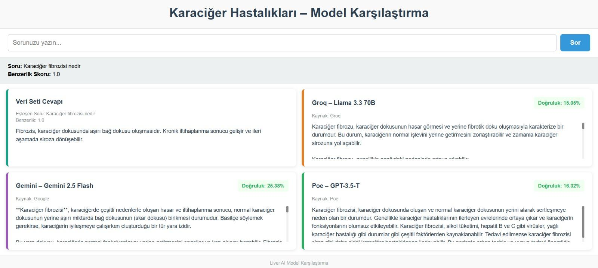
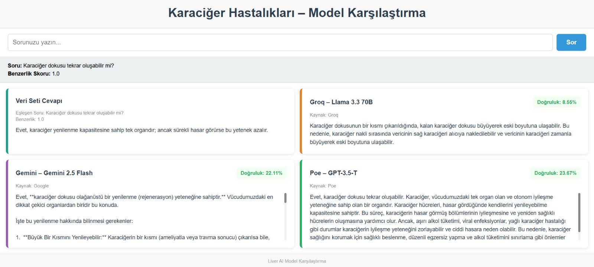
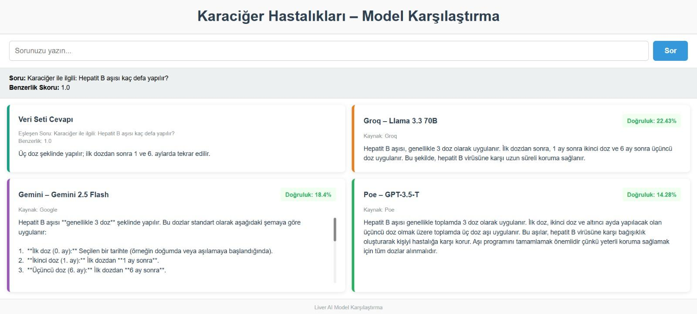

#  Liver Artificial Intelligence Comparison System

Hybrid QA system comparing dataset-based answers with multiple LLM providers for liver disease questions.

##  Project Overview

This project is a hybrid Question Answering (QA) system developed to compare responses from:

-  Dataset-based TF-IDF similarity matching
-  Groq – Llama 3.3 70B
-  Google – Gemini 2.5 Flash
-  Poe – GPT-3.5-Turbo

The system first checks whether a user question matches a predefined medical dataset using cosine similarity.  
If similarity exceeds a threshold (0.60), the dataset answer is returned.  
Otherwise, the system queries multiple LLM providers and compares their responses.

---

##  System Architecture

User Question  
→ TF-IDF Vectorization  
→ Cosine Similarity Check  
→ If similarity ≥ 0.60 → Dataset Answer  
→ Else → Call LLM APIs (Groq, Gemini, Poe)

---
##  Technologies Used

- Python
- Flask
- Pandas
- Scikit-learn (TF-IDF, Cosine Similarity)
- REST APIs (Groq, Gemini, Poe)
- HTML/CSS (Frontend)

---

## Application Screenshots

